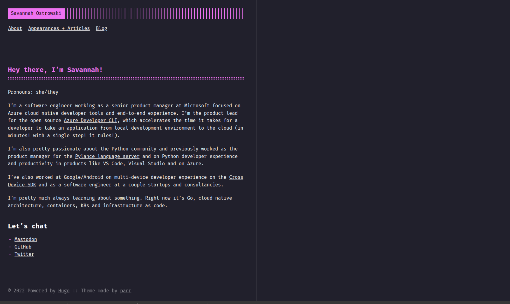

# Savannah's Personal Site
This is my personal website, written in Go using Hugo via the [Terminal theme](https://github.com/panr/hugo-theme-terminal). This site is compatible with [the Azure Developer CLI (`azd`)](https://github.com/azure/azure-dev) such that it can have its infrastructure provisioned and its code deployed in a single step via `azd up` (hosted on Azure Container Apps).

## Provision and Deploy
If you want to give it a shot:
1. Install [the Azure Developer CLI](https://aka.ms/azd) and its dependencies
1. Run `azd up -t savannahostrowski/terminal-personal-site`
1. Pass in an environment name, Azure subscription and region
1. Watch magic happen.

## Local Development
1. Navigate into the `src/` directory and run `hugo server -t hugo-theme-terminal`

## Customization
1. Edit the files in `src/content` to make it your own
1. Update or remove the backlink to Mastodon in `src/themes/hugo-theme-terminal/layouts/_default/single.html` on line 5. I wanted my website link to be verified :)
1. Run `azd deploy` to deploy the new code up to your already provisioned infrastructure (done via `azd up`)

For further stylistic changes, you can check out [this config.toml](https://github.com/panr/hugo-theme-terminal#how-to-configure) from the theme's creator.
