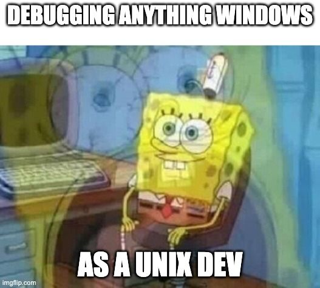
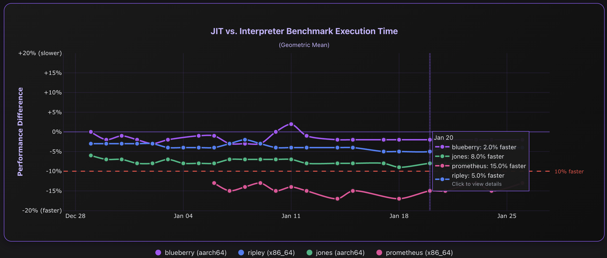

So recently, I was nerdsnipped into building a performance dashboard for the JIT by [Brett](https://snarky.ca/) on Bluesky.

It's a seemingly basic question that we did not have an answer to, up until very recently.

So, I did what any sane person would do! Naturally, I set up four different runners across different architectures and operating systems, and created a website to answer the most important question: [does JIT go brrr?](https://doesjitgobrrr.com)

## Building a server farm (accidentally)

I didn't _really_ plan to scope creep things this much. I started with just a single Raspberry Pi running the benchmark suite nightly, around the same time I set up my RPi buildbot. But, one thing led to another, and all of a sudden I'm running a small server farm in my closet (which isn't totally off brand for me as I have been known to [roll my own infra](https://savannah.dev/posts/raspberry-pi-cluster/) from time to time!).

In any case, I was also motivated to set this up so that we could have a reliable pipeline set up to collect benchmark stats on consumer-grade hardware. We have access to beefy, server-grade machines via corporate sponsors, but those aren't necessarily representative of a basic laptop or a Raspberry Pi. I figured it could be pretty interesting to see how things were going. So I took inventory of the random machines lying around the house, and ended up with this suite of machines:

| Runner | Hardware | OS | Architecture |
|--------|----------|-----|--------------|
| blueberry | Raspberry Pi 5 | Linux | aarch64 |
| ripley | Intel i5 | Ubuntu 24.04 | x86_64 |
| jones | M3 Pro MacBook | macOS | aarch64 |
| prometheus | AMD Ryzen 5 3600X | Windows 11 | x86_64 |

…and before you ask, yeah, the majority of these machines have names related to the Alien franchise (I'm a big fan!). Blueberry is just blueberry, because Pi 🥧!

## How the benchmarking stack works

Okay, so that's roughly the hardware setup but before diving into the software side of things, it helps to understand how the pieces fit together. Thankfully, this is where I could lean on existing projects like [bench_runner](https://github.com/faster-cpython/bench_runner). 

bench_runner is really the tooling or framework for how this all comes together. I'm not going to delve too deep into the setup here since it's well documented in the [repo's README](https://github.com/faster-cpython/bench_runner/blob/main/README.md) but really this is what handles actually running the [pyperformance](https://github.com/python/pyperformance) benchmark suite on self-hosted GitHub Actions runners. It calculates the improvements, handles all the options to enable optimization flags, generates comparison plots and result tables.

For context, pyperformance is the benchmark suite focused  on real-world benchmarks rather than synthetic ones. This matters because we want to measure how actual Python code performs, not just micro-optimizations that don't translate to real applications.

bench_runner also relies on your having configured a results repository, in my case: [pyperf_bench](https://github.com/savannahostrowski/pyperf_bench). This is where all the results, plots, stats etc. get stored after each run. Workflows are triggered from this repo, a self-hosted runner picks it up and uses bench_runner to build CPython and run benchmarks, and then results are committed back here.

## Setting up self-hosted runners

The actual runner setup was surprisingly straightforward — GitHub's [self-hosted runner documentation](https://docs.github.com/en/actions/hosting-your-own-runners/managing-self-hosted-runners/adding-self-hosted-runners) walks you through it. You're basically downloading a runner application, configuring it with a token from your repo, and running it as a service. The runner then polls GitHub for jobs that match its labels.

The trickier part is getting the benchmarking environment right. Each machine needs:
- **Build dependencies** for compiling CPython from source (gcc/clang, make, libssl-dev, etc.)
- **LLVM** installed (the JIT needs it for compilation)
- **bench_runner** and its dependencies
- A system relatively free from background process noise…

That last point is where things get fun. Benchmarking is all about reducing variance, and consumer hardware loves variance. You really want stable, reproducible results, which means minimizing anything that could interfere with CPU cycles while benchmarks are running.

Each machine had its own quirks (non-exhaustive):

On the Pi, thermal throttling meant I needed a better cooler. The Pi 5 starts throttling at 80°C and gets more aggressive at 85°C—when that happens, the CPU drops from 2.4GHz down to 1.5GHz, which would absolutely tank benchmark consistency. I also had to fiddle with IRQ affinity permissions since I wanted to pin benchmark processes to specific CPU cores to reduce noise.

Windows had a parade of permission errors…and literally everything on Windows doesn’t work the way I’d expect so that debugging was pretty unfun.

And macOS? [aargh, mediaanalysisd](https://bsky.app/profile/savannah.dev/post/3m6e5s6ofuk2o). If you ever decommission a MacBook and decide to use it as a GitHub Actions runner, make sure you've completely turned off iCloud syncing. Otherwise this friendly background daemon will come along scanning photos for AI features like face recognition and object detection, eating CPU cycles for hours and completely wrecking your benchmark stability. 

All this to say, it's not too tricky but expect some friction and debugging  if you try to set one up yourself!

## The dashboard pipeline

Here's what happens every night:
- Each runner runs the benchmark suite twice:  once for the interpreter, once with the JIT enabled, via a GitHub Action on a cron schedule
- The results are compared per machine to derive the speedup
- After all runs finish, I trigger a dashboard refresh which runs a script on another Raspberry Pi cluster (since I also self-host everything 🤠). The script pulls any new results, computes the geometric mean using pyperf, and loads everything into the database.
- Results appear on [doesjitgobrrr.com](https://doesjitgobrrr.com) shortly after!

## So, what have we learned?

If you recall from various PyCon talks, Brandt has jokingly said the JIT was "0% faster/slower" for quite a while. However, things are actually coming together now! Results are quite dependent on operating system and hardware specs, but preliminary results show that the JIT is about [4-5% faster](https://docs.python.org/3.15/whatsnew/3.15.html#whatsnew315-jit) than the interpreter on x86-64 Linux, and 7-8% faster on AArch64 macOS over the tail-calling interpreter in 3.15, as evidenced by runners sponsored by Meta.

However, my server farm does show more interesting results! On our [nightly runs](https://doesjitgobrrr.com/?goals=10)  funded by yours truly, we're regularly seeing:
- ~2% speedups on my Raspberry Pi 5 (blueberry) — aarch64
- ~5% speedups on my i5 running Ubuntu 24.04 (ripley) — x86_64
- ~8% speedups on my M3 Pro (jones) — aarch64
- ~15% speedups on my AMD Ryzen 5 3600X running Windows 11 (prometheus) — x86_64

Beyond tracking nightly progress, the dashboard has also helped us catch performance regressions from PRs the same day they land, which feels awesome! The power of data!

…and to be honest, that's pretty awesome if you ask me. Yes, we still have work ahead of us, but man, I'm super proud of all the work we've done over the past few months that have gotten us this far. The JIT has also become pretty community-driven at this point, and we're actively building up new contributors! Super exciting stuff!

## Reading materials and links
- [The unofficial JIT performance dashboard — does JIT go brrr?](https://doesjitgobrrr.com/)
- [pyperf_bench — where all my data lives from our runs](https://github.com/savannahostrowski/pyperf_bench)
- [doesjitgobrrr on GitHub](https://github.com/savannahostrowski/doesjitgobrrr)
- [bench_runner — for running pyperformance on GitHub Actions runners](https://github.com/faster-cpython/bench_runner)
- [pyperformance — the benchmark suite](https://github.com/python/pyperformance)
- [pyperf — toolkit for Python benchmarking](https://pyperf.readthedocs.io/en/latest/)
- [PEP 744 — JIT Compilation](https://peps.python.org/pep-0744/)
