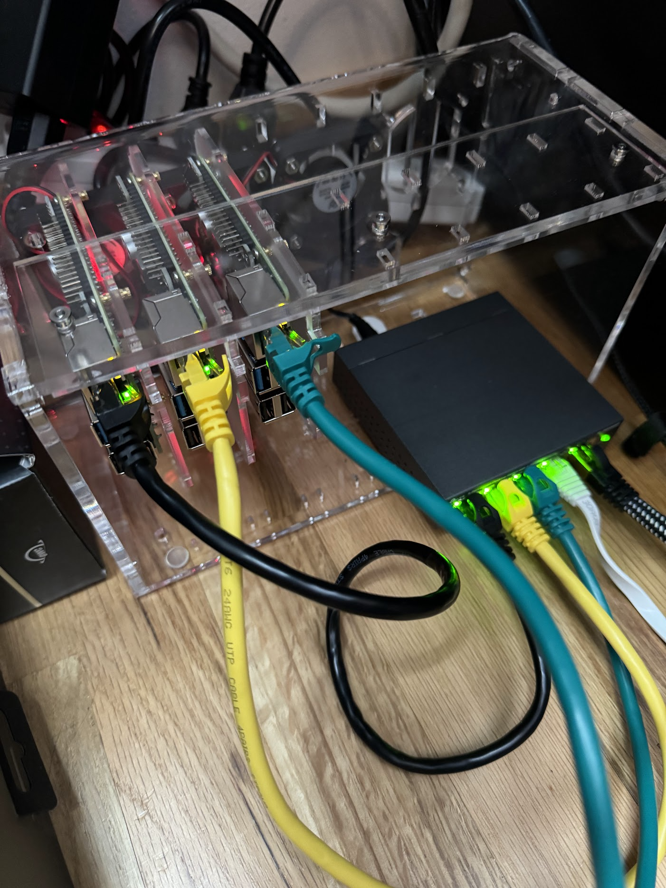
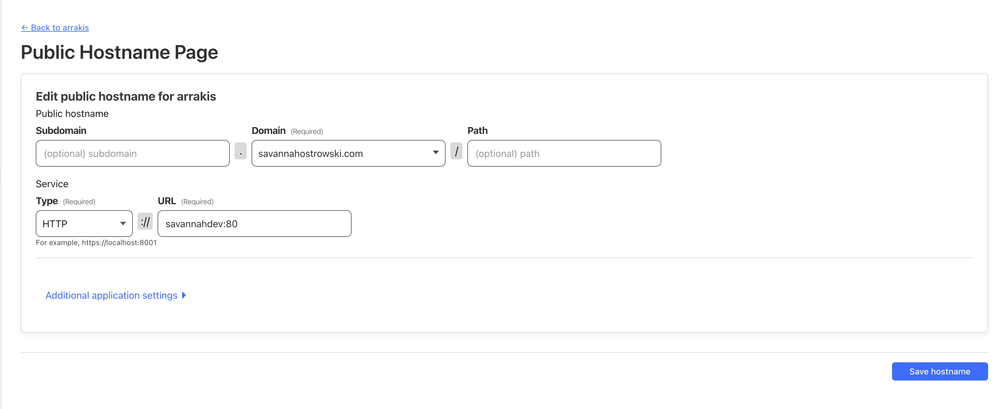

This post is an overview of how I went off the grid – or, in other words, moved all my personal websites off Azure and onto a Raspberry Pi cluster sitting in my home office. This isn't exactly a tutorial blog post, but feel free to use this as a reference. 

## Why do this at all?

You might be wondering, "Savannah, why do this? Didn't you used to work on Azure tooling full-time?" To which I'd reply, "Yes, yes I did." But really, this isn't about criticizing Azure or any other major cloud service provider. I simply enjoy physical computing, like to experiment, and also no longer receive any free employee credits for Azure, so I thought, why not?

## Meet Arrakis!

Alright, I might have had Dune on the brain when I built this, but Dune Part Two is literally a masterpiece, so can you blame me? My little rig consists of 3 Raspberry Pi 4Bs (each with 4 CPUs and 8 GB RAM), all running Raspberry Pi OS Lite (64-bit), which is a port of Debian Bullseye without a desktop environment. Each of these devices uses Power over Ethernet (PoE) for networking and power over a single cable per Pi. I'll delve into this a bit later, but it's worth noting that the cluster doesn't run Kubernetes; instead, it leverages Docker Swarm to create the cluster (it's literally 2 commands to configure everything – mind blown!).



### Materials for the build

I'll be candid – this wasn't cheap. Raspberry Pis are hot commodities, so it cost me a pretty penny to gather everything I needed for this build. I'll link what I bought, but do keep in mind that prices may vary. At the time of building, this set me back approximately $506.67 USD.


| Item                                                                                          | Price (in USD) | Notes                                                                                                                               |
| --------------------------------------------------------------------------------------------- | -------------- | ----------------------------------------------------------------------------------------------------------------------------------- |
| [C4Labs Cloudlet Case in Clear](https://www.amazon.com/gp/product/B07D5NM9ZG)                 | $99.08  | Though I'm only building a 3 Pi cluster right now, this gives me some space to store the Switch or add additional Pis in the future |
| [TP-Link TL-SG1005P, 5 Port Gigabit PoE Switch](https://www.amazon.com/gp/product/B076HZFY3F) | $49.53 |                                                                                                        |
| [UCTRONICS PoE HAT for Raspberry Pi (3x)](https://www.amazon.com/gp/product/B082ZLDMZ6)       | $21.99         |                                                                                                                                     |
| [1.5-ft Ethernet cables (6 pack)](https://www.amazon.com/gp/product/B00GBBSX92)               | $16.99         |                                                                                                                                     |
| [Raspberry Pi 4 Model B 8GB (3x)](https://www.amazon.com/gp/product/B0899VXM8F)               | $82.71         | Obviously, this is where I spent the most money.                                                                                    |
| [SanDisk Ultra 32GB Micro SD](https://www.amazon.com/gp/product/B00M55C0NS)                   | $8.99          |                                                                                                                                     |
| **Total**                                                                                     | $506.67        |                                                                                                                                     |

That said, if you're following along, you may need a couple of other things depending on what you have lying around at home, like a memory card reader for imaging the SD cards. Thankfully, I had one built into my USB dock, so this was unnecessary.


## Setting up the cluster

### Step 1: Image a micro SD card for each Pi

After assembling the cluster physically, it was time to sort out the software bits. First, I imaged each micro SD card with Raspberry Pi OS Lite using the [Raspberry Pi Imager utility](https://www.raspberrypi.com/software/), and then I inserted each micro SD into each Pi. A vital step here is to remember to go into options and tick the box that allows you to configure SSH with a password before imaging the SD cards.

### Step 2: Install Docker 🐳

Then, I waited for each of them to appear on my home network and grabbed their IP addresses and made note of which Pi had which IP address. After that, I ssh'd into each one and [installed Docker](https://docs.docker.com/engine/install/debian/) using the official release (which gets updated more frequently than Docker distributed via distros...heck yes, Moby 26 is out!). I had 3 different terminal tabs opened while I was working so I could switch between them quickly.

Next, I waited for each Pi to appear on my home network, grabbed their IP addresses, and noted which Pi had which IP address. Then, I SSH'd into each one and installed [Docker](https://docs.docker.com/engine/install/debian/) )using the official release (which gets updated more frequently – Moby 26 is out!). I had 3 different terminal tabs open while working, allowing me to switch between them quickly.

### Step 3: Create the cluster using Docker Swarm

I'll be honest – I initially planned to set up the cluster with Kubernetes via k3s, but boy howdy, that gave me so many problems right from the get-go. Also, it's a bit of a meme to [host your blog on Kubernetes](https://twitter.com/dexhorthy/status/856639005462417409), so I quickly changed my plan and decided to use Swarm instead. Setting this up was truly magical, save for one snag. Here's how it works:

- Choose one of your Pis to be your Swarm leader.
- Run `docker swarm init` in the Swarm leader's terminal.
- Copy the generated command and token (docker swarm join).
- Paste the `docker swarm join` command into the other Pi terminals.
- Boom! You have yourself a cluster ✨
  
Seriously, it's that simple! You can validate that everything is working as expected using `docker node ls` on any of your nodes.


> Note: I did run into one little snag with networking, where the default network of the cluster overlapped 1:1 with my home network. I discovered this much later when ingress was broken and I couldn't figure out why. Before moving on, it might be worth verifying that this is not the case. If it is, the fix is fairly simple. You'll just need to [customize the ingress network](https://docs.docker.com/engine/swarm/networking/#customize-ingress). Shout out to [this StackOverflow post](https://stackoverflow.com/questions/59007780/container-running-on-docker-swarm-not-accessible-from-outside/63405536#63405536) for helping me debug this!


### Step 4: Write the `docker-compose.yml` for your services

Time to define our services! In this case, I had two websites I wanted to host: 1) my [personal website](https://savannahostrowski.com) and

Time to get to defining our services! In this case, I had two websites I wanted to host: 1) my [personal website](https://savannahostrowski.com) (where you're reading this post!) and 2) an [uber-professional website](https://getshreked.com) that is an inside joke.

If you're familiar with Docker, this part is quite straightforward. I had already pushed my website images up to Docker Hub, so this was a pretty quick operation. The only Swarm-specific thing I needed to do is to tell Docker that I had a custom network called `arrakis` and then make sure that my services connect to it.

```
services:
  savannahdev:
    image: "savannahostrowski/savannah.dev"
    ports:
     - "8080:80"
    networks:
     - arrakis
    deploy:
     mode: replicated
     replicas: 3
  getshreked:
   image: "savannahostrowski/getshreked"
   ports:
     - "8081:80"
   networks:
     - arrakis
   deploy:
     mode: replicated
     replicas: 3
networks:
  arrakis: {}
  ```

Deploying this Compose file is a single command using `docker stack deploy --compose-file docker-compose.yml arrakis` from the leader node. Once this command was run, I validated that the services were operational via `docker stack services arrakis`.

At this point, you should be able to hit the endpoints on any one of the cluster node IPs and see your website!

### Step 5: Set up `cloudflared` as a service in the cluster

The last bit here was to obfuscate my IP addresses and make this all accessible to the outside world via my chosen domains. If you thought the cluster setup was magic, just wait until you see how simple it was to set this bit up.

Thanks to CloudFlare, I'm able to do this all via [Tunnels](https://developers.cloudflare.com/cloudflare-one/connections/connect-networks/) – or, rather, a single Cloudflared tunnel in my case. This was really as easy as going to my CloudFlare dashboard, creating a tunnel, copying an installation command to paste into my leader node (`sudo cloudflared service install <token>`), creating another service in my `docker-compose.yml`, and then redeploying the stack (`docker stack deploy --compose-file docker-compose.yml arrakis`).

```
services:
  savannahdev:
    image: "savannahostrowski/savannah.dev"
    ports:
     - "8080:80"
    networks:
     - arrakis
    deploy:
     mode: replicated
     replicas: 3
  getshreked:
   image: "savannahostrowski/getshreked"
   ports:
     - "8081:80"
   networks:
     - arrakis
   deploy:
     mode: replicated
     replicas: 3
  cloudflared:
   image: "cloudflare/cloudflared"
   command: "tunnel --no-autoupdate run --token <my-token-here>"
   deploy:
    restart_policy:
     condition: on-failure
    mode: replicated
    replicas: 3
   networks:
    - arrakis
networks:
  arrakis: {}
  ```

The last bit here is to configure your public hostnames. In my case, I had one for each website I was deploying. What's really neat is that you just have to pass in the service `name:port` (where service name matches the Compose service name and port matches your port internal to the container) for it to all work.


## Bonus: Set up Tailscale for easy access to my cluster nodes

This isn't required but I also took advantage of [Tailscale](https://tailscale.com/)'s free tier (up to 100 devices!) for easy access to my cluster nodes.

And that's pretty much it! Hopefully you found this sort of fun - I sure did!