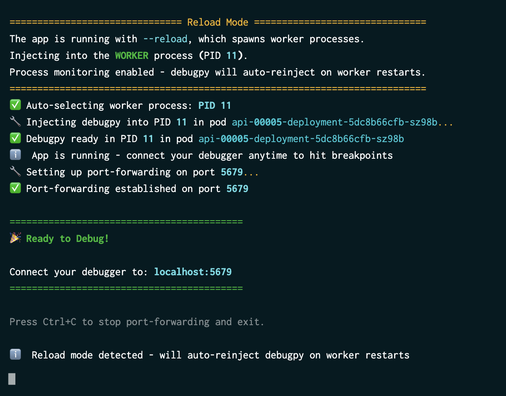

As you may already know, I love containers. I think they are truly a magical and amazing piece of technology because of the freedom and ease of use they afford. However, using containers (or Kubernetes) can add complexity to your workflow. When we stick our software in a container, we naturally add a bit of a barrier between our local development environment and the software we’re building, unless of course you’re using a Dev Container in which case things get pretty meta…but I digress.

One particular area where using containers or Kubernetes adds friction is in debugging workflows. That FastAPI app that you’re running with Docker Compose or Kubernetes? Yeah, the debugger isn’t going to just magically connect after configuring your `launch.json` file and running it in VS Code anymore. Maybe you’ve ended up setting up some kind of sidecar service to run your debugging in your cluster. Or, maybe you’ve added [debugpy](https://github.com/microsoft/debugpy) to your code, configured it to wait for connections, restarted  your pod, set up port-forwarding, and *hoped* your app is still in the right state by the time you connect. Oh yeah, and throw a `uvicorn --reload` in there and…aaaaaaa. Setting all of that up is a true headache and honestly, pretty peripheral to the task at hand! You were just trying to debug that app you’re building anyway!

So, I built a tool that I'm calling [`debugwand`](https://github.com/savannahostrowski/debugwand) - a zero-preparation remote debugger for Python applications running in Kubernetes clusters or Docker containers. With `debugwand`, there's no sidecar pod, no application code changes, and virtually no setup required (okay, just a teeny tiny bit...it's just configuration!). 


> *Containers hate to see me comin'*

How, you might ask? This brings me to perhaps the single coolest feature in Python 3.14  that makes this all possible (okay, okay…I’m being dramatic – this is like picking a favourite child!): [`sys.remote_exec()`](https://docs.python.org/3/library/sys.html#sys.remote_exec). With `sys.remote_exec()`,  we can execute a Python script *inside another running process* all without restarting it. The script runs with full access to the target's memory, modules, and state, which is  exactly what you need to start a debug server on-demand.

## So what does debugwand do?

When you run `wand debug`, the CLI goes out and:

1. **Finds your target**  - For Kubernetes, it discovers pods for your service (and handles Knative, because of course you're using Knative). For Docker, you just point it at a container.

1. **Picks a process** - It finds all the Python processes running in the pod/container with CPU and memory stats, so (tries to) choose the right one. Running `uvicorn --reload`? It'll detect that automatically too (you can always override the choice if you want to debug a different process).

1. **Injects [`debugpy`](https://github.com/microsoft/debugpy)** - Here's where` sys.remote_exec()` does its thing. `debugwand` writes a small script that starts a `debugpy` server and injects it into your running process. No restart. No code changes. Your app keeps serving requests like nothing happened.

1. **Sets up the connection** - For Kubernetes, it handles port-forwarding automatically. For Docker, you just need to expose the port when you start the container.

1. **You connect your editor** - Point VS Code (or nvim, or whatever [DAP](https://microsoft.github.io/debug-adapter-protocol/) client you like) at `localhost:5679` (you can choose whatever port you’d like as well) and you're debugging. Set breakpoints, inspect variables, step through code - the works.



The whole flow to get everything set up should only take a few minutes to configure things and then you should be off to the races! Pretty neat, huh?

## You can try it out

> A quick note: This tool is experimental and intended for local development. Enabling `SYS_PTRACE` capabilities has security implications you'll want to consider before using this anywhere near production (don’t do that!).

While I built this primarily out of curiosity and for our workflow at work, you’re welcome to give this a shot! If you're running Python 3.14, give it a spin by `uv tool install debugwand` (see PyPI [here](https://pypi.org/project/debugwand/)).

After that, you’ll need to:
- Ensure your cluster/container has [SYS_PTRACE kernel capabilities enabled](https://github.com/savannahostrowski/debugwand/blob/main/docs/troubleshooting.md#permission-denied--cap_sys_ptrace). Remember! Local development only, please!
- Make sure you’ve port forwarded 5679 (or whatever port you want to use)
- Set up your [launch.json](https://github.com/savannahostrowski/debugwand#connect-your-editor) if you’re using VS Code.

Then it’s just:
```
# Kubernetes
wand debug -n my-namespace -s my-service

# Docker 
wand debug --container my-container
```

And then you’re off to the races! Just start your debugger and set some breakpoints!

## Reading materials and links
- [Remote debugging attachment protocol](https://docs.python.org/3.14/howto/remote_debugging.html#remote-debugging)
- [`debugwand` on GitHub](https://github.com/savannahostrowski/debugwand)
- [`debugwand` on PyPI](https://pypi.org/project/debugwand/)


